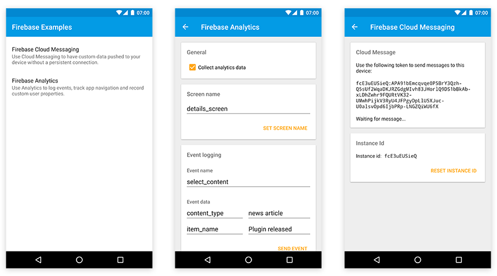

# Tabris.js Firebase Plugin

The `tabris-plugin-firebase` plugin provides a [Tabris.js](https://tabrisjs.com) API to interact with various [firebase](https://firebase.google.com/) features. The plugin supports [firebase cloud messaging](https://firebase.google.com/docs/cloud-messaging/) and [firebase analytics](https://firebase.google.com/docs/analytics/) with support for more features underway.



## Integrating the plugin

The Tabris.js website provides detailed information on how to [integrate custom plugins](https://tabrisjs.com/documentation/latest/build#adding-plugins) in your Tabris.js app.

### Add the plugin to your project

The plugin should be added as an entry in the apps `config.xml` file:

```xml
<plugin name="tabris-plugin-firebase" spec="^2.0.0" />
```

To fetch the latest development version use the GitHub url:

```xml
<plugin name="tabris-plugin-firebase" spec="https://github.com/eclipsesource/tabris-plugin-firebase.git" />
```

#### Provide the firebase credentials

To enable firebase support in your app, we have to provide the credential files for Android and iOS. The files can be obtained from the [firebase console](https://console.firebase.google.com).

##### Android

For Android we have to [include the `google-services.json` file](https://firebase.google.com/docs/android/setup#add_firebase_to_your_app). To make it available to the `tabris-plugins-firebase` you have to place it in the same folder as your apps `config.xml` file. If the file is missing the plugin will print an appropriate error message.


##### iOS

For iOS we have to [include the `GoogleService-Info.plist` file](https://firebase.google.com/docs/ios/setup#add_firebase_to_your_app). To make it available to the `tabris-plugins-firebase` you have to place it in the same folder as your apps `config.xml` file.

In addition you _have to_ include `GoogleService-Info.plist` file as a [`resource-file`](https://cordova.apache.org/docs/en/latest/config_ref/#resource-file) in the `config.xml`:

```xml
<platform name="ios">
  <resource-file src="GoogleService-Info.plist" />
</platform>
```

## Documentation

The Tabris.js firebase plugin supports the following features:

Feature | Supported platforms
--- | ---
[Firebase Cloud Messaging](doc/cloud-messaging.md) | Android, iOS
[Firebase Analytics](doc/analytics.md) | Android, iOS

## Compatibility

Compatible with [Tabris.js](https://www.npmjs.com/package/tabris) 3.x.

## Plugin development

While not required by the consumer of the plugin, this repository provides Android specific development artifacts. These artifacts allow to more easily consume the native source code when developing the native parts of the plugin.

### Android

The project provides a gradle based build configuration, which also allows to import the project into Android Studio.

In order to reference the Tabris.js specific APIs, the environment variable `TABRIS_ANDROID_PLATFORM` has to point to the Tabris.js Android Cordova platform root directory.

```bash
export TABRIS_ANDROID_PLATFORM=/home/user/tabris-android
```
 The environment variable is consumed in the gradle projects [build.gradle](project/android/build.gradle) file.

## Copyright

Published under the terms of the [BSD 3-Clause License](LICENSE).
