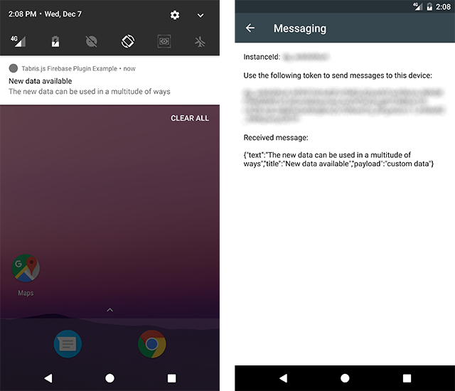

# Tabris.js Firebase Plugin

The `tabris-plugin-firebase` plugin project provides a [Tabris.js](https://tabrisjs.com) API to receive [firebase cloud messages](https://firebase.google.com/docs/cloud-messaging/). The plugin allows to receive notification data when the app is in the foreground or to automatically display a notification when the app is not running or in the background. Currently only Android is supported with iOS support coming in the future.



## Example

The following snippet shows how the `tabris-plugin-firebase` plugin can be used to receive a cloud message in a Tabris.js app.

```js
console.log('Token to send to server: ' + firebase.Messaging.token);

firebase.Messaging.on('tokenChanged',
    ({value: token}) => console.log('Server token refreshed: ' + token));

firebase.Messaging.on('message',
    ({data}) => console.log('Received message data: ' + JSON.stringify(data)));

console.log('Message data from app cold start: ' + firebase.Messaging.launchData);
```

A more elaborate example can be found in the [example](example/) folder. It provides a Tabris.js cordova project that demonstrates the various features of the `tabris-plugin-firebase` integration. When building the example project make sure to run `npm install` inside its `www` folder to fetch the Tabris.js dependencies.

To [send a message](https://firebase.google.com/docs/cloud-messaging/send-message) from the server side a `curl` command similar to the following `POST` request can be used:

```shell
curl -X POST -H "Authorization: key=<server-key>" -H "Content-Type: application/json" -d '{
    "to": "<token>",
    "data": {
      "title": "New data",
      "text": "The new data arrived",
      "payload": "custom data"
    }
  }
' https://fcm.googleapis.com/fcm/send
```

## Integrating the plugin
Using the plugin follows the standard cordova plugin mechanism. The Tabris.js website provides detailed information on how to [integrate custom plugins](https://tabrisjs.com/documentation/latest/build#adding-plugins) in your Tabris.js app.

### Add the plugin to your project

The plugin can be added like any other cordova plugin. Either via the `cordova plugin add` command or as an entry in the apps `config.xml` (recommended):

```xml
<!-- THE PLUGIN IS NOT YET AVAILABLE ON NPMJS.COM -->
<!-- <plugin name="tabris-plugin-firebase" spec="1.0.0" /> -->
```

To fetch the latest development version use the GitHub url:

```xml
<plugin name="tabris-plugin-firebase" spec="https://github.com/eclipsesource/tabris-plugin-firebase" />
```

#### Provide the firebase credentials

To enable the firebase support in your app, you have to [provide the `google-services.json` file](https://firebase.google.com/docs/android/setup#add_firebase_to_your_app) which contains the apps ids and credentials. The file can be obtained from the [firebase console](https://console.firebase.google.com).

To make the `google-services.json` file available to the `tabris-plugins-firebase` you have to place it in the same folder as your apps `config.xml` file. If the file is missing the plugin will print an appropriate error message.

#### Notification icon (optional)

An Android [notification icon](https://developer.android.com/guide/practices/ui_guidelines/icon_design_status_bar.html) can be provided via the plugin variable `ANDROID_NOTIFICATION_ICON`. To configure an icon the resource id of an Android drawable inside the Android platforms `res` folder has to be specified. A build hook can be used to copy the notification icon from your project into the `android` platform `res` folder. See the [example project](example/scripts/android/copy_icons.js) for a snippet to get you started.

The icon can be configured inside your apps `config.xml`:

```xml
<plugin name="tabris-plugin-firebase" spec="1.0.0">
  <variable name="ANDROID_NOTIFICATION_ICON" value="@drawable/ic_notification" />
</plugin>
```

Alternatively the image can be added during the `cordova plugin add` command:

```bash
cordova plugin add <path-to-tabris-firebase-plugin> --variable ANDROID_NOTIFICATION_ICON=`icon_drawable_name`
```

When no notification icon is specified, the outline of the app icon is used.

## Send message with notification from server

When the server sends a message to a device it can create two types of messages: "notification" messages and "data" messages. Messages that contain a `notification` key in its json payload are treated as "notification" message. More details of the differences between "notification" and "data" messages can be found in the [firebase documentation](https://firebase.google.com/docs/cloud-messaging/concept-options#notifications_and_data_messages).

The key difference for this plugin is that "notification" messages create their notification automatically when the app is in the background. Tapping on the notification _does not forward the notification data to the app_.

To create a notification that also delivers its data to the app, when the notification is tapped, a regular "data" notification has to be created. A "data" message does _not_ have a key `notification`.

To configure the notification several properties can be set:

- `id` : `number`
- `title` : `string`
- `text` : `string`

The following message send from a server would create a notification similar to the [screenshot](assets/screenshots/firebase.png) above:

```shell
POST /fcm/send HTTP/1.1
Host: fcm.googleapis.com
Authorization: key=<server-key>
Content-Type: application/json

{
  "to": "<token>",
  "data": {
    "title": "New data available",
    "text": "The new data can be used in a multitude of ways",
    "payload": "custom data"
  }
}
```

Note that the json object above does not contain a `notification` key. It only provides the `to` key to declare the message receiver and the data payload send to the app.

Using the same `id` for multiple messages updates an existing notification on the users device. Omitting the `id` creates a random id on the device so that each message results in a unique notification.

## API documentation

The firebase messaging API is represented as the global object `firebase.Messaging`.

### `Messaging`

#### Properties

All `Messaging` properties are read only.

##### `instanceId` : _string_

* A stable identifier that uniquely identifies the app installation. Note that on Android the instance id can become invalid as noted in the [documentation](https://firebase.google.com/docs/reference/android/com/google/firebase/iid/FirebaseInstanceId.html).

##### `token` : _string_

* A registration `token` to be used on the server side to address an app installation. The registration `token` is usually available but can change during the apps lifetime. To get notified of a registration token updates you should listen for `tokenChanged` events. When resetting the `instanceId`, the token is not available until the `tokenChanged` event fired.

##### `launchData` : _object_

* Contains the cloud message data when the app is cold started from a notification. There are two scenarios of message data delivery:
  1. When the app is in the foreground (or running in the background and the user taps on the notification) the `message` event callback is invoked.
  2. In case the app process is not running and the app is freshly launched (cold started) from a notification, the data contained within that notification is available in the `launchData` object.

* The recommended way to make sure your app receives all messaging data is to check the `firebase.Messaging.launchData` object on app startup and to register for the `message` event to receive follow-up messages.

#### Events

##### `instanceIdChanged`

* The `instanceIdChanged` event is fired asynchronously when the `resetInstanceId()` method is invoked.

###### Event Parameters:

* `target` : _Messaging_
  * The `Messaging` object which allows to interact with firebase cloud messaging
* `instanceId` : _string_
  * The new `instanceId` of the app

##### `tokenChanged`

* The `tokenChanged` event is fired when the current registration token has changed. Check the firebase [documentation](https://firebase.google.com/docs/reference/android/com/google/firebase/iid/FirebaseInstanceId.html) for details when that might be the case.

###### Event Parameters:

* `target` : _Messaging_
  * The `Messaging` object which allows to interact with firebase cloud messaging
* `token` : _string_
  * The new registration `token` to send to the server

##### `message`

* The `message` event is fired when a cloud message is received by a running app. This can either be while the app is in the foreground or the user clicks on a notification while the app is running in the background. To get the message data while the app is cold launched from a notification see the `launchData` property.

###### Event Parameters:

* `target` : _Messaging_
  * The `Messaging` object which allows to interact with firebase cloud messaging
* `data` : _object_
  * The message `data` object as send from the server side

#### Methods

##### `resetInstanceId()`

* Invalidates the current `instanceId` and creates a new one asynchronously. To be notified when a new `instanceId` is available you should listen for the `instanceIdChanged` event. Resetting the `instanceId` also resets the associated registration `token`. A `tokenChanged` event will be fired once a new token is available.

## Compatibility

Compatible with [Tabris.js 2.0.0](https://github.com/eclipsesource/tabris-js/releases/tag/v2.0.0)

## Development of the plugin

While not required by the consumer of the plugin, this repository provides Android specific development artifacts. These artifacts allow to more easily consume the native source code when developing the native parts of the plugin.

### Android

The project provides a gradle based build configuration, which also allows to import the project into Android Studio.

In order to reference the Tabris.js specific APIs, the environment variable `TABRIS_ANDROID_PLATFORM` has to point to the Tabris.js Android Cordova platform root directory.

```bash
export TABRIS_ANDROID_PLATFORM=/home/user/tabris-android
```
 The environment variable is consumed in the gradle projects [build.gradle](project/android/build.gradle) file.

## Copyright

Published under the terms of the [BSD 3-Clause License](LICENSE).
