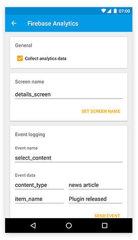

# Firebase Analytics

The `tabris-plugin-firebase` plugin project provides a [Tabris.js](https://tabrisjs.com) API to track app usage via [firebase analytics](https://firebase.google.com/docs/analytics/). The tracked data is available in the firebase console. The plugin support screen and event tracking as well as user properties.



## Enable analytics tracking
By default the plugin does _NOT_ track any usage data. You have to enable analytics tracking by setting `analyticsCollectionEnabled` to `true`:

```js
firebase.Analytics.analyticsCollectionEnabled = true;
```

## Example

The following example shows typical usage of the analytics API:

```js
// enable analytics data collection (has to be done upfront)
firebase.Analytics.analyticsCollectionEnabled = true;

// provide more details about the current user
firebase.Analytics.setUserPoperty(`power_user`, true);

// set the screen name where subsequent events are tracked
firebase.Analytics.screenName = 'main_screen';

// track event triggered by user
firebase.Analytics.logEvent('view_item', {description: 'full_membership'});
```

## API

The firebase analytics API is represented as the global object `firebase.Analytics`.

### `Analytics`

#### Properties

All `Analytics` properties are _write only_.

##### `analyticsCollectionEnabled` : _boolean_

* Enables analytics data collection for this app. To make use of firebase analytics data collection _has to be enabled_ by the developer. The enablement persists across sessions.

##### `screenName` : _string_

* Sets the current screen name, which specifies the current visual context in your app. This helps identify the areas in your app where users spend their time and how they interact with your app.

##### `userId` : _string_

* Sets the user ID property. Should not expose sensitive data.

#### Methods

##### `logEvent(eventName, parameters)`

* Logs an app event. The event can have up to 25 parameters. Events with the same name must have the same parameters. Up to 500 event names are supported. Using predefined [event](https://firebase.google.com/docs/reference/android/com/google/firebase/analytics/FirebaseAnalytics.Event) and/or [parameters](https://firebase.google.com/docs/reference/android/com/google/firebase/analytics/FirebaseAnalytics.Param) is recommended for optimal reporting.

##### `setUserProperty(propertyName, value)`

* Sets a user property to a given value. Up to 25 user property names are supported. Once set, user property values persist throughout the app lifecycle and across sessions.
