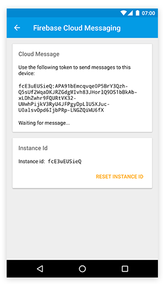

# Firebase Cloud Messaging

The `tabris-plugin-firebase` plugin project provides a [Tabris.js](https://tabrisjs.com) API to receive [firebase cloud messages](https://firebase.google.com/docs/cloud-messaging/). The plugin allows to receive notification data when the app is in the foreground or to automatically display a notification when the app is not running or in the background. Currently only Android is supported with iOS support coming in the future.




## Example

The following snippet shows how the `tabris-plugin-firebase` plugin can be used to receive a cloud message in a Tabris.js app.

```js
console.log('Token to send to backend: ' + firebase.Messaging.token);

firebase.Messaging.on('tokenChanged',
    ({token}) => console.log('Server token refreshed: ' + token));

firebase.Messaging.on('message',
    ({data}) => console.log('Received message data: ' + JSON.stringify(data)));

console.log('Message data from app cold start: ' + firebase.Messaging.launchData);
```

A more elaborate example can be found in the [example](../example/) folder. It provides a Tabris.js app that demonstrates the various features of the `tabris-plugin-firebase` integration.

To [send a message](https://firebase.google.com/docs/cloud-messaging/send-message) from the server side a `curl` command similar to the following `POST` request can be used:

```shell
curl -X POST -H "Authorization: key=<server-key>" -H "Content-Type: application/json" -d '{
    "to": "<token>",
    "data": {
      "title": "New data",
      "body": "The new data arrived",
      "payload": "custom data"
    }
  }
' https://fcm.googleapis.com/fcm/send
```

### Custom notification icon (optional)

An Android [notification icon](https://developer.android.com/guide/practices/ui_guidelines/icon_design_status_bar.html) can be provided via the plugin variable `ANDROID_NOTIFICATION_ICON`. To configure a notification icon a 
resource id of an Android drawable can be specified. The `<resource-file />` cordova directive can be used to copy the file into the Android folder `app/src/main/res/`. See the [example 
 config.xml](../example/cordova/config.xml) for a snippet to get you started.

The icon can be configured inside your apps `config.xml`:

```xml
<plugin name="tabris-plugin-firebase" spec="^2.0.0">
  <variable name="ANDROID_NOTIFICATION_ICON" value="@drawable/ic_notification" />
</plugin>

<platform name="android">
  <resource-file src="res/android/drawable-xhdpi/ic_notification.png"
                 target="app/src/main/res/drawable-xhdpi/ic_notification.png" />
</platform>
```

When no notification icon is specified, the outline of the app icon is used.

## Send message with notification from server

When the server sends a message to a device it can create two types of messages: "notification" messages and "data" messages. Messages that contain a `notification` key in its json payload are treated as "notification" message. More details of the differences between "notification" and "data" messages can be found in the [firebase documentation](https://firebase.google.com/docs/cloud-messaging/concept-options#notifications_and_data_messages).

The key difference for this plugin is that "notification" messages create their notification automatically when the app is in the background. Tapping on the notification _does not forward the notification data to the app_.

To create a notification that also delivers its data to the app, when the notification is tapped, a regular "data" notification has to be created. A "data" message does _not_ have a key `notification`.

To configure the notification several properties can be set:

- `id` : `number`
- `title` : `string`
- `body` : `string`

The following message send from a server would create a notification similar to the [screenshot](doc/img/firebase.png) above:

```shell
POST /fcm/send HTTP/1.1
Host: fcm.googleapis.com
Authorization: key=<server-key>
Content-Type: application/json

{
  "to": "<token>",
  "data": {
    "title": "New data available",
    "body": "The new data can be used in a multitude of ways",
    "payload": "custom data"
  }
}
```

Note that the json object above does not contain a `notification` key. It only provides the `to` key to declare the message receiver and the data payload send to the app.

Using the same `id` for multiple messages updates an existing notification on the users device. Omitting the `id` creates a random id on the device so that each message results in a unique notification.

## API

The firebase messaging API is represented as the global object `firebase.Messaging`.

### `Messaging`

#### Properties

All `Messaging` properties are read only.

##### `instanceId` : _string_

* A stable identifier that uniquely identifies the app installation. Note that on Android the instance id can become invalid as noted in the [documentation](https://firebase.google.com/docs/reference/android/com/google/firebase/iid/FirebaseInstanceId.html).

##### `token` : _string_

* A registration `token` to be used on the server side to address an app installation. The registration `token` is usually available but can change during the apps lifetime. To get notified of a registration token updates you should listen for `tokenChanged` events. When resetting the `instanceId`, the token is not available until the `tokenChanged` event fired.

##### `launchData` : _object_

* Contains the cloud message data when the app is cold started from a notification. There are two scenarios of message data delivery:
  1. When the app is in the foreground (or running in the background and the user taps on the notification) the `message` event callback is invoked.
  2. In case the app process is not running and the app is freshly launched (cold started) from a notification, the data contained within that notification is available in the `launchData` object.

* The recommended way to make sure your app receives all messaging data is to check the `firebase.Messaging.launchData` object on app startup and to register for the `message` event to receive follow-up messages.

#### Events

##### `instanceIdChanged`

* The `instanceIdChanged` event is fired asynchronously when the `resetInstanceId()` method is invoked.

###### Event Parameters:

* `target` : _Messaging_
  * The `Messaging` object which allows to interact with firebase cloud messaging
* `instanceId` : _string_
  * The new `instanceId` of the app

##### `tokenChanged`

* The `tokenChanged` event is fired when the current registration token has changed. Check the firebase [documentation](https://firebase.google.com/docs/reference/android/com/google/firebase/iid/FirebaseInstanceId.html) for details when that might be the case.

###### Event Parameters:

* `target` : _Messaging_
  * The `Messaging` object which allows to interact with firebase cloud messaging
* `token` : _string_
  * The new registration `token` to send to backend server

##### `message`

* The `message` event is fired when a cloud message is received by a running app. This can either be while the app is in the foreground or the user clicks on a notification while the app is running in the background. To get the message data while the app is cold launched from a notification see the `launchData` property.

###### Event Parameters:

* `target` : _Messaging_
  * The `Messaging` object which allows to interact with firebase cloud messaging
* `data` : _object_
  * The message `data` object as send from the server side

#### Methods

##### `resetInstanceId()`

* Invalidates the current `instanceId` and creates a new one asynchronously. To be notified when a new `instanceId` is available you should listen for the `instanceIdChanged` event. Resetting the `instanceId` also resets the associated registration `token`. A `tokenChanged` event will be fired once a new token is available.

##### `requestPermissions()` (iOS-only)

* Shows the system dialog for requesting permissions for the first time. Does nothing if the permissions have been requested already. The dialog will only be shown again when calling this method if the app has been uninstalled for at least a day or if the device has been restored (see ["Resetting the Push Notifications Permissions Alert on iOS"](https://developer.apple.com/library/archive/technotes/tn2265/_index.html#//apple_ref/doc/uid/DTS40010376-CH1-TNTAG42) for more information).
